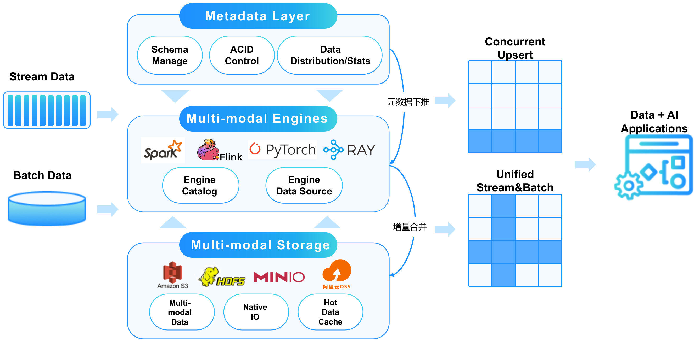

<!--
SPDX-FileCopyrightText: 2023 LakeSoul Contributors

SPDX-License-Identifier: Apache-2.0
-->

LakeSoul 是一款开源云原生湖仓一体框架，具备高可扩展的元数据管理、ACID 事务、高效灵活的 upsert 操作、Schema 演进和批流一体化处理等特性。LakeSoul 支持多种计算引擎读写湖仓表数据，包括 Spark、Flink、Presto、PyTorch，支持批、流、MPP、AI 多种计算模式。LakeSoul 支持 HDFS、S3 等存储系统。

LakeSoul 由数元灵科技研发并于 2023 年 5 月正式捐赠给 Linux Foundation AI & Data 基金会，成为基金会旗下 Sandbox 孵化项目。

LakeSoul 专门为数据湖云存储之上的数据进行行、列级别增量更新、高并发入库、批量扫描读取做了大量优化。云原生计算存储分离的架构使得部署非常简单，同时可以以很低的成本支撑极大的数据量。

LakeSoul 通过类似 LSM-Tree 的方式在哈希分区主键 upsert 场景支持了高性能的写吞吐能力。同时高度优化的 Merge on Read 实现也保证了读性能（参考 [性能对比](https://lakesoul-io.github.io/zh-Hans/blog/2023/04/21/lakesoul-2.2.0-release)）。LakeSoul 通过 PostgreSQL 来管理元数据，实现元数据的高可扩展性和高并发事物能力。

LakeSoul 使用 Rust 实现了 native 的元数据层和 IO 层，并封装了 C/Java/Python 接口，从而能够支持大数据和 AI 等多种计算框架对接。

LakeSoul 支持流、批并发读写，读写全面兼容 CDC 语义，通过自动 Schema 演进和严格一次语义等功能，能够轻松构建全链路流式数仓。

更多特性和其他产品对比请参考：[特性介绍](https://lakesoul-io.github.io/zh-Hans/docs/intro)

# 使用教程
* [湖仓对接 AI：使用 Python 进行数据预处理和模型训练](https://github.com/lakesoul-io/LakeSoul/tree/main/python/examples)：LakeSoul 将湖仓和 AI 无缝衔接，打造 Data+AI 的现代数据架构。
* [CDC 整库入湖教程](https://lakesoul-io.github.io/zh-Hans/docs/Tutorials/flink-cdc-sink): LakeSoul 通过 Flink CDC 实现 MySQL 等多种数据库的整库同步，支持自动建表、自动 DDL 变更、严格一次（exactly once）保证。
* [Flink SQL 教程](https://lakesoul-io.github.io/zh-Hans/docs/Usage%20Docs/flink-lakesoul-connector)：LakeSoul 支持 Flink 流、批读写。流式读写完整支持 Flink Changelog 语义，支持行级别流式增删改。
* [多流合并构建宽表教程](https://lakesoul-io.github.io/zh-Hans/docs/Tutorials/mutil-stream-merge)：LakeSoul 原生支持多个具有相同主键的流（其余列可以不同）自动合并到同一张表，消除 Join.
* [数据更新 (Upsert) 和 Merge UDF 使用教程](https://lakesoul-io.github.io/zh-Hans/docs/Tutorials/upsert-and-merge-udf)：LakeSoul 使用 Merge UDF 自定义 Merge 逻辑的用法示例。
* [快照相关功能用法教程](https://lakesoul-io.github.io/zh-Hans/docs/Tutorials/snapshot-manage): LakeSoul 快照读、回滚、清理等功能用法。
* [增量查询教程](https://lakesoul-io.github.io/zh-Hans/docs/Tutorials/incremental-query): Spark 中增量查询（支持流、批两种模式）用法。

# 使用文档

[快速开始](https://lakesoul-io.github.io/zh-Hans/docs/Getting%20Started/setup-local-env)

[使用文档](https://lakesoul-io.github.io/zh-Hans/docs/Usage%20Docs/setup-meta-env)

# 特性路线
[Feature Roadmap](https://github.com/lakesoul-io/LakeSoul#feature-roadmap)

# 社区准则
[社区准则](community-guideline-cn.md)

# 问题反馈

欢迎提 issue、discussion 反馈问题。

### 微信公众号
欢迎关注 <u>**元灵数智**</u> 公众号，我们会定期推送关于 LakeSoul 的架构代码解读、端到端算法业务落地案例分享等干货文章：

### LakeSoul 开发者社区微信群
欢迎加入 LakeSoul 开发者社区微信群，随时交流 LakeSoul 开发相关的各类问题：请关注公众号后点击下方 "了解我们-用户交流" 获取最新微信群二维码。

# 联系我们
发送邮件至 [lakesoul-technical-discuss@lists.lfaidata.foundation](mailto:lakesoul-technical-discuss@lists.lfaidata.foundation).

# 开源协议
LakeSoul 采用 Apache License v2.0 开源协议。