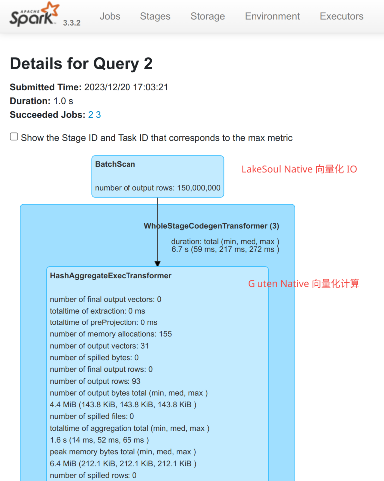

# Read and write LakeSoul in Spark Gluten

:::tip
Since 2.5.0
:::

Spark Gluten (https://github.com/oap-project/gluten) is an open source project developed based on the Spark plug-in interface. It aims to inject native code vectorization execution capabilities into Apache Spark to greatly optimize the execution efficiency of Spark. The project has been jointly built by Intel and Kyligence since 2021. The underlying layer uses Meta's open source Velox physical execution framework, focusing on injecting more efficient instructions into Spark to execute physical plans.

In the Spark Gluten project, developers do not need to invade the Spark code base, but use Spark's extension mechanism to replace the physical execution layer implementation to achieve optimization effects. For the steps before physical planning, Spark's existing code can be used, which combines Spark's framework capabilities and enhances the performance of the executor.

Gluten is already able to receive batch data in Arrow format as input, but Gluten does not know that the LakeSoul data source supports Arrow. Therefore, in LakeSoul, when we detect that the Gluten plug-in is turned on, we insert a new physics plan rewrite rule, remove redundant column-row-column conversion, and directly connect LakeSoul's Scan physical plan to the subsequent Gluten calculation physical plan. As shown below:



## Spark task configuration
When the Spark job starts, configure the Gluten plug-in and LakeSoul in the following ways:
```shell
$SPARK_HOME/bin/spark-shell --master local\[1\] --driver-memory 4g \
   # The following are the configuration items required by the Gluten plug-in
   --conf "spark.driver.extraJavaOptions=--illegal-access=permit -Dio.netty.tryReflectionSetAccessible=true" \
   --conf spark.plugins=io.glutenproject.GlutenPlugin \
   --conf spark.memory.offHeap.enabled=true \
   --conf spark.shuffle.manager=org.apache.spark.shuffle.sort.ColumnarShuffleManager \
   --conf spark.memory.offHeap.size=1g \
   --conf spark.sql.codegen.wholeStage=false \
   # The following are the configuration items required by LakeSoul
   --conf spark.sql.extensions=com.dmetasoul.lakesoul.sql.LakeSoulSparkSessionExtension \
   --conf spark.sql.catalog.lakesoul=org.apache.spark.sql.lakesoul.catalog.LakeSoulCatalog \
   --conf spark.sql.defaultCatalog=lakesoul \
   # Introduce the jars of LakeSoul and Gluten
   --jars lakesoul-spark-spark-3.3-VAR::VERSION.jar,gluten-velox-bundle-spark3.3_2.12-1.1.0.jar
```
After starting the Spark task in this way, Gluten and LakeSoul can be enabled at the same time to achieve dual acceleration of IO performance and computing performance.

Gluten's Jar can be downloaded from https://github.com/oap-project/gluten/releases. Please choose Spark 3.3's jar.