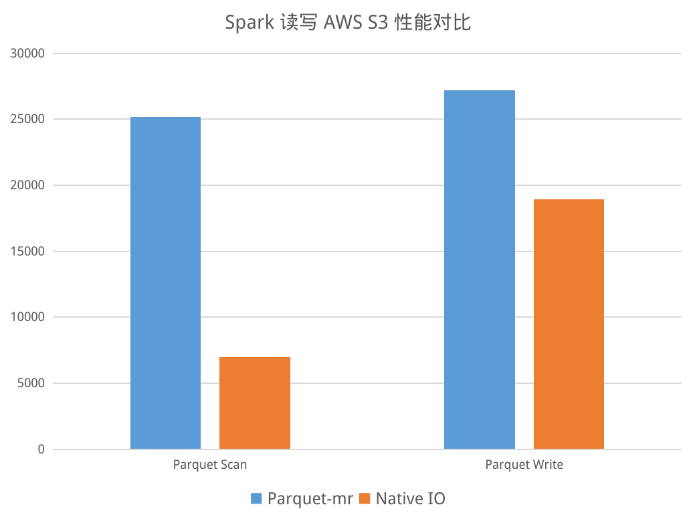
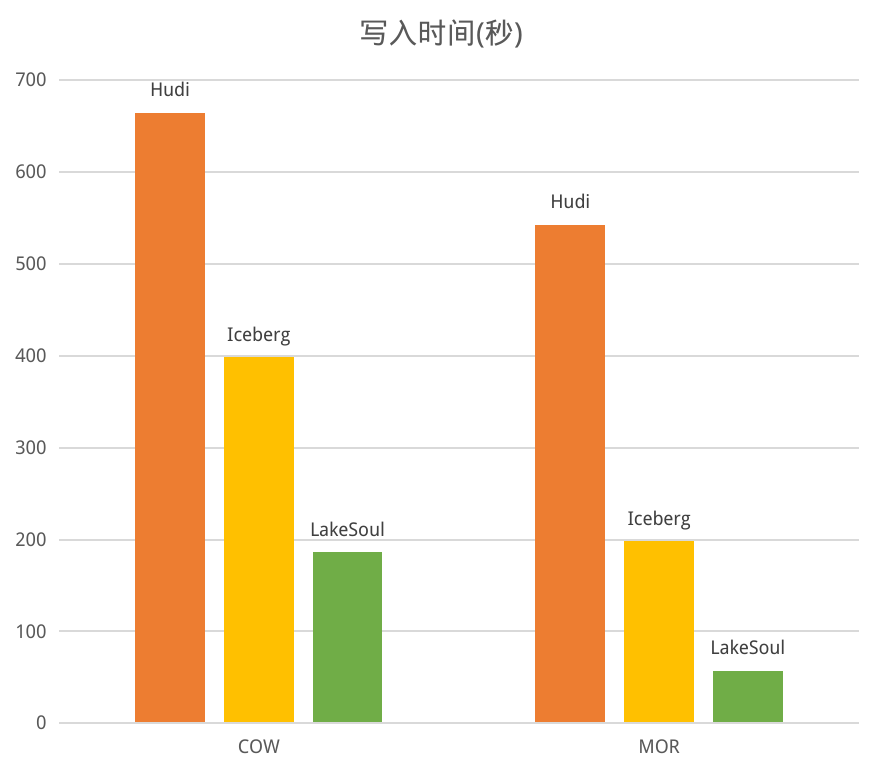
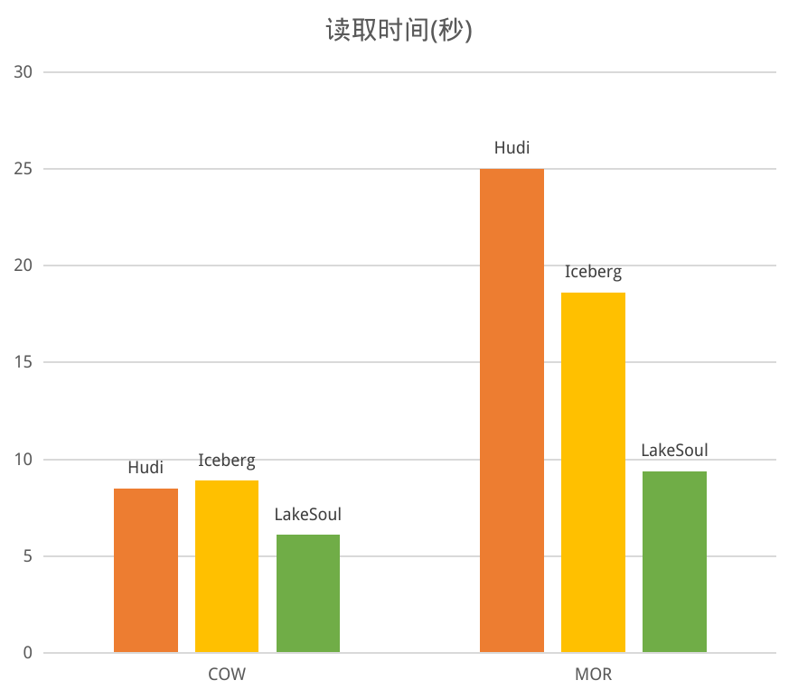

# LakeSoul 发布 2.2.0 版本，全面升级 Native IO，扩大云原生湖仓性能领先幅度

<!--
SPDX-FileCopyrightText: 2023 LakeSoul Contributors

SPDX-License-Identifier: Apache-2.0
-->

近日，经过数月研发，开源湖仓框架 LakeSoul 发布了 2.2.0 版本（[Github 发布日志](https://github.com/lakesoul-io/LakeSoul/releases/tag/v2.2.0)），这个版本最重要的升级是在 Spark、Flink 中默认启用了全新的 Native IO，性能再次获得显著提升，扩大了 LakeSoul 在云原生湖仓框架领域的性能领先优势。本文为您详细解读 LakeSoul 2.2.0 版本的更新以及 Native IO 的技术细节。

## LakeSoul 2.2.0 版本更新内容

在 2.2.0 版本中，LakeSoul 实现了全新的 Native IO，将全量、增量的读写逻辑都迁移到了新的 IO 层实现，并做了大量性能和正确性测试，在 Spark 和 Flink 中都默认启用了新 IO 层。

2.2.0 版本还发布了 Spark 中的[快照读取、回滚和清理](https://lakesoul-io.github.io/zh-Hans/docs/Tutorials/snapshot-manage)、[增量批式读取、增量流式读取](https://lakesoul-io.github.io/zh-Hans/docs/Tutorials/incremental-query)等多个新接口，从而更为完善地支持高性能的流式增量的 ETL 数据建模流程。以下我们详细讲解这几个新的改进和功能点。

### 1. Native IO 详细解读

作为云原生湖仓框架，对云存储以及 HDFS 的读写性能是重中之重。LakeSoul 支持流批一体的特性，在存储上针对主键表支持 Upsert 更新写入和 Merge on Read 读取，IO 层的实现有一定的复杂度。先前 LakeSoul 的 Upsert 写入主要依赖计算框架来实现，例如在 Spark 中，需要由 Spark 对主键进行 shuffle 和排序后写入存储，而读取时则在 Spark 中实现了一套有序文件归并的 Reader。这套实现带来几个问题：

1. 性能有优化空间。LakeSoul 主键模型采用哈希分桶有序的方式存储，在 Upsert 写入时不需要与历史合并，带来很高的写吞吐，但是 MOR 读时需要做多个文件的有序归并，在文件数较多的情况下，尤其是在高延迟对象存储的场景下，读性能有较大的影响，需要优化。
2. 原方案与 Spark 耦合较紧，不方便在 Flink 等其他计算引擎中复用读写逻辑，尤其是较为复杂的 MOR 读逻辑。
3. 原方案采用 Java 实现，不方便对接其他语言如 C++ 实现的计算引擎。

综合考虑以上几个问题，LakeSoul 选择使用 Native Code （Rust 语言）重新实现 IO 层的读写逻辑，并向上层提供基于 CFFI 的接口，以方便 Java、Python 等其他语言进行进一步封装，从而与计算引擎对接。具体的设计和实现包括如下几点：

1. 使用 Apache Arrow 和 Rust

    LakeSoul 使用 Parquet 作为物理存储格式，因此我们选择使用 Arrow 作为 IO 的内存中间表示层，一方面是因为 Arrow 作为成熟的内存列格式，有丰富的库支持，例如 Rust 的实现 Arrow-rs，另一方面选用列式格式可以获得向量化加速的能力，也能够很方便的对接向量化计算引擎。

    LakeSoul 依赖 Arrow 的 Rust 实现，即 [arrow-rs](https://github.com/apache/arrow-rs)，其中已经包含了 Parquet Reader、Writer，以及对象存储的抽象层 object_store，能够很好地支持诸如 S3 等云原生对象存储。而选择 Rust 实现，主要考虑是 Rust 对异步的支持较为完善，对对象存储的操作均可实现为 async 接口，能够通过异步的方式对 IO 进行进一步优化。

2. LakeSoul Native Writer

    LakeSoul 的 Native Writer，通过 Arrow-rs 中的 object_store 库所封装的 [MultipartUpload](https://docs.amazonaws.cn/AmazonS3/latest/userguide/mpuoverview.html) 功能来实现单文件并发写。具体来说，Parquet 文件可以组织成多个 RowGroup，每个 RowGroup 会提前在内存中序列化为一个连续的 buffer。LakeSoul 将一个 RowGroup buffer 作为一个对象存储的 part，提交给后台线程异步上传，与此同时计算线程可以继续组织下一个 RowGroup 的内容，从而实现了单文件在对象存储上并发写入。

    LakeSoul Native Writer 支持在写入时对主键进行排序，这里使用了 [Arrow DataFusion](https://github.com/apache/arrow-datafusion) 库的 Sort 实现，其支持将排序中间结果溢写（spill）到磁盘，这样 Writer 可以支持大批量的数据写入，这在 Flink Sink 中有比较重要的意义。其原因是主键的排序只是对同一批写入的文件排序，而 LakeSoul 的 Flink Sink 仅在 Flink 执行 checkpoint 时写出文件，而两次 checkpoint 间隔可能很长。通过磁盘溢写，避免了占用过大内存导致 OOM 的问题。

    使用对象存储的 MultipartUpload 还有一个优势，就是消除了 staging 中间文件以及 commit 时的文件拷贝开销。Staging 文件原先是为了避免在目标表或分区目录下出现尚未完整写入的结果，避免引起下游读到不完整的数据。无论是 Flink 还是 Spark，在写 Staging 文件时需要先在一个临时目录下写入，commit 时再重命名临时目录为最终目标目录，这样会带来溢写额外的开销，尤其是对象存储不支持原子重命名时，需要完整拷贝一遍数据。并且 Staging 文件也使得 Flink Sink 状态维护更为复杂。LakeSoul 支持 MultipartUpload 的 abort 操作，如果中间取消写入，则会 abort 未写完的文件，并且 LakeSoul 的元数据层在 Spark、Flink 中均实现了两阶段提交协议来保证一致性。

3. LakeSoul Native Reader

    Reader 部分，我们主要针对对象存储访问 Parquet 文件和 MOR 多个有序文件归并这两个方面做了优化。

    对象存储通常有着较高的延迟，arrow-rs 中的 object_store 库已经做了包括小请求合并（coalesce）和并发请求的优化，在我们实际测试中效果仍不够理想。因此我们做了两方面的进一步优化：
    
    一是拆分读请求为多个并发请求。对象存储的底层实际是 HTTP 协议，可以在 HTTP 请求体中指定要访问的对象文件的范围。我们将单个请求的范围大小限定在 8M 以内，大于 8M 的请求会自动拆分成多个并发请求，避免一次请求中访问太大的文件范围造成长时间的阻塞等待。
    
    第二个优化是对 Parquet 的 RowGroup 做后台异步 prefetch。这个同样也是为了能够让计算线程和 IO 线程能够同时工作，用预取掩盖延迟。默认会预取一个 RowGroup，避免占用过大内存。

    在 MOR 有序归并方面，我们基于 arrow-rs 实现了多个 Arrow RecordBatch 异步流的归并。实现时采用了 arrow-rs 提供的 Row Format 来优化主键的序关系比较性能，使用 interleave 来优化多个流合并为一个 RecordBatch 的性能。

4. Spark、Flink 引擎对接 Native IO 层
   
   前面提到，Native IO 层采用 Rust 实现。在其之上，我们封装了一层 C 接口，提供读和写的功能。其中读取时支持同步阻塞和异步回调两种方式，方便上层根据需要选择（写时只提供阻塞接口，因为底层已经做了 Multipart 上传的并发）。在 C 接口之上，使用 [jnr-ffi](https://github.com/jnr/jnr-ffi) 实现了 Java 接口。最后在 Spark、Flink 侧分别实现了 Reader 和 Writer 的对接。

5. LakeSoul IO 性能评测
   
   LakeSoul 的 Native IO 层对 Parquet 文件格式实现了向量化的读写，并对对象存储做了异步并发、预取等性能优化。对 Parquet 文件的直接读写，相比 Spark、Flink 中原生的 parquet-mr 和 Hadoop S3A 的实现，有着显著的性能提升：

   

    我们也做了 LakeSoul 与 Hudi、Iceberg 在 COW、MOR 场景下的读写性能对比评测。评测场景是首先写入 1000 万条数据，然后 Upsert 10 次，每次 200 万行。该性能评测的数据和代码均已公开，见[性能评测代码库](https://github.com/meta-soul/ccf-bdci2022-datalake-contest-examples/tree/mor)。性能对比如下：

    

    写性能方面，对于 COW 模式，三个框架都需要全量重写数据，计算开销基本一致，LakeSoul 借助 Native IO 的优化，性能是最好的。对于 MOR 模式，LakeSoul 采用的主键分桶排序模式，不需要维护索引更新，因此取得了很高的写吞吐，显著优于其他两个框架。

    

    读性能方面，对于 COW 模式，都是读取合并后的文件，没有 merge 开销，LakeSoul 同样得益于 IO 层优化取得领先。而对于 MOR 模式，虽然 LakeSoul 的有序合并相比 Hudi 的 bloom filter 过滤和 Iceberg 的 pos-delete 过滤在理论性能上有劣势，但是 LakeSoul 凭借 IO 层的多项优化，读性能仍然领先 Iceberg 1倍。

    值得一提的是，LakeSoul 在读写过程中，CPU、内存占用也都是三个框架之中最小的。另外，LakeSoul 的 MOR 读，将增量数据拆分为 100 次 Upsert 写入后，读性能仅有约 15% 的下降，也意味着 LakeSoul 可以在高频写入更新，并且没有 compaction 的情况下，仍然保证较好的读性能。

### 2. 快照和增量读取功能介绍

LakeSoul 2.2.0 针对快照、增量场景，提供了一系列新的接口。LakeSoul 采用了 MVCC 的多版本控制机制，会在元数据中记录每个版本所对应的文件。因此可以很容易地支持快照读（又称 Time Travel），即读取之前某个时间点的数据快照版本。LakeSoul 还能够支持回滚到某个时间点的数据，方便在最新数据有问题时还原到之前的正确版本。

对于快照读、快照回滚、快照清理，使用者只需要提供快照的时间点，用时间戳字符串表示，例如`"2022-01-01 15:15:15"`，该时间戳不需要与实际写入时间严格对应，这个时间会作为写入版本的时间戳上界，LakeSoul 会自动找到小于等于该时间戳所对应的快照版本。

快照相关的功能点可以参考[快照使用教程](https://lakesoul-io.github.io/zh-Hans/docs/Tutorials/snapshot-manage)

LakeSoul 还提供了增量读取功能。在流式 ETL 中，增量读取功能具有重要意义，增量读能够让整个 ETL 链路都转为增量计算，提高实时性的同时还能节约计算资源。LakeSoul 2.2.0 支持在 Spark 中的增量 batch 读取、增量流式读取。增量流式读取时，LakeSoul 会作为 Spark 的 Streaming 数据源，自动发现并读取表的增量数据。具体使用方法可以参考[增量查询教程](https://lakesoul-io.github.io/zh-Hans/docs/Tutorials/incremental-query)。

值得一提的是，不同于 Hudi、Iceberg，LakeSoul 对于主键表、非主键表均可支持增量读，对于 LakeSoul CDC 表（[参考 LakeSoul CDC 表格式](https://lakesoul-io.github.io/zh-Hans/docs/Tutorials/flink-cdc-sink)），也同样能够增量读取 CDC 流，这个流表示了 LakeSoul 表本身的增量修改，包括 insert、update 和 delete 操作，能够支持下游灵活的增量计算。在下一个版本，LakeSoul 将支持 LakeSoul 表的 CDC 增量流式读取为 Flink ChangeLog Stream，借助 Flink SQL 即可完成高效的流式增量 ETL 开发。

## 总结

LakeSoul 2.2.0 发布了全新的 Native IO ，进一步扩大了云原生湖仓框架领域的性能优势。提供了快照和增量的接口，能够更好地支持流式数据建模开发。

在下个版本，LakeSoul 将会发布全局自动 Compaction，Flink Stream SQL Source 等重要功能，敬请期待。
