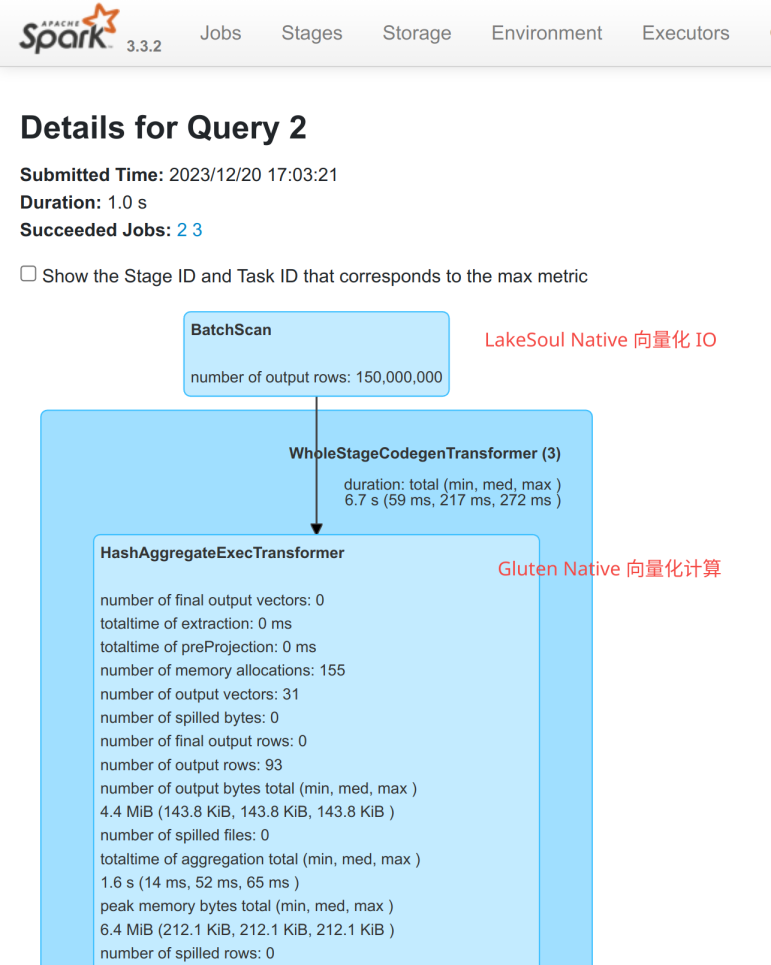

# 在 Spark Gluten 中读写 LakeSoul

:::tip
自 LakeSoul 2.5.0 起支持
:::

Spark Gluten （https://github.com/oap-project/gluten） 是一个基于 Spark 插件接口开发的开源项目，旨在为 Apache Spark 注入原生代码向量化执行的能力，以极大优化 Spark 的执行效率和成本。该项目由 Intel 和 Kyligence 自2021年开始合作共建，底层使用 Meta 开源的 Velox 物理执行层框架，专注于为 Spark 注入更高效的指令来执行物理计划。

在 Spark Gluten 项目中，开发人员不需要侵入 Spark 代码库，而是通过 Spark 的扩展机制，替换物理执行层实现，来达到优化效果。对于物理计划之前的步骤则可延用Spark现有代码，这样既结合了 Spark 的框架能力又增强了执行器的性能。

Gluten 已经能够接收 Arrow 格式的 batch 数据作为输入，但是 Gluten 并不知道 LakeSoul 数据源支持 Arrow。因此我们在 LakeSoul 中，当检测到 Gluten 插件开启时，插入一条新的物理计划重写规则，去除多余的 列-行-列 转化，直接将 LakeSoul 的 Scan 物理计划对接到后续的 Gluten 计算物理计划，如下图所示：


## Spark 任务配置
在 Spark 作业启动时，通过以下方式，配置 Gluten 插件以及 LakeSoul：
```shell
$SPARK_HOME/bin/spark-shell --master local\[1\] --driver-memory 4g \
  # 以下为 Gluten 插件所需的配置项
  --conf "spark.driver.extraJavaOptions=--illegal-access=permit -Dio.netty.tryReflectionSetAccessible=true" \
  --conf spark.plugins=io.glutenproject.GlutenPlugin \
  --conf spark.memory.offHeap.enabled=true \
  --conf spark.shuffle.manager=org.apache.spark.shuffle.sort.ColumnarShuffleManager \
  --conf spark.memory.offHeap.size=1g \
  --conf spark.sql.codegen.wholeStage=false \
  # 以下为 LakeSoul 所需的配置项
  --conf spark.sql.extensions=com.dmetasoul.lakesoul.sql.LakeSoulSparkSessionExtension \
  --conf spark.sql.catalog.lakesoul=org.apache.spark.sql.lakesoul.catalog.LakeSoulCatalog \
  --conf spark.sql.defaultCatalog=lakesoul \
  # 引入 LakeSoul、Gluten 的 jar
  --jars lakesoul-spark-3.3-VAR::VERSION.jar,gluten-velox-bundle-spark3.3_2.12-1.1.0.jar
```
以这样的方式启动 Spark 任务后，即可同时启用 Gluten 和 LakeSoul，实现 IO 性能、计算性能的双重加速。

Gluten 的 Jar 可以从 https://github.com/oap-project/gluten/releases 这里下载，需要选择 Spark 3.3 版本。